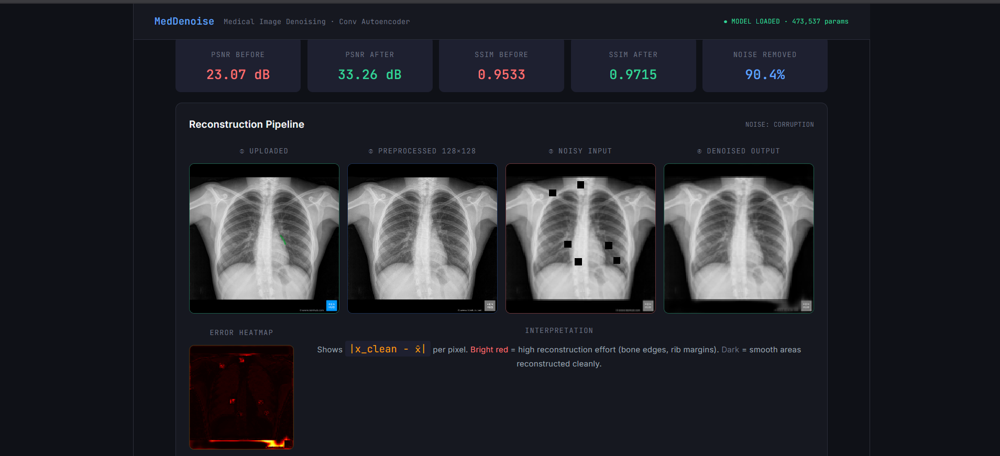

# 🩺 MedDenoise — Medical Image Denoising System

> A deep learning-powered web application that denoises medical chest X-ray images using a **U-Net Convolutional Autoencoder with skip connections**, served via a Flask backend and a React frontend.

🔗 **GitHub:** https://github.com/SatyamChaturvedi39/MedDenoise  
🌐 **Live Demo:** _Deploying soon_

## App Screenshot



## Problem Statement

Medical imaging equipment, especially portable X-ray machines used in rural clinics and disaster zones, produces noisy images due to low radiation doses. This noise can obscure critical diagnostic features — hairline fractures, early-stage pneumonia opacities, subtle nodules — potentially leading to misdiagnosis. MedDenoise addresses this by enabling clinicians to upload any chest X-ray and receive an instant, AI-denoised reconstruction — along with quality metrics — without requiring expensive hardware upgrades.

## What This Project Does

MedDenoise takes a chest X-ray image as input and:

1. Converts it to 128×128 grayscale and normalizes pixel values to [0, 1]
2. Applies a selected clinical noise simulation (Quantum Noise, Severe Noise, Dead Pixels, or Data Loss)
3. Passes the corrupted image through a trained Convolutional Denoising Autoencoder
4. Reconstructs a clean version by leveraging learned anatomical structure
5. Computes quality metrics — PSNR, SSIM, MSE — before and after denoising
6. Generates an error heatmap showing where the model worked hardest
7. Displays all results in a side-by-side reconstruction pipeline view

## Project Flow

```
User uploads chest X-ray image (drag & drop or browse)
↓
React frontend sends image to Flask backend via POST /api/denoise
↓
Backend preprocesses image: convert to grayscale, resize to 128×128, normalize to [0,1]
↓
Backend applies selected noise type (Gaussian, Salt & Pepper, Block Corruption)
↓
Convolutional Autoencoder runs inference → outputs denoised 128×128×1 image
↓
Backend computes PSNR, SSIM, MSE metrics (before vs after denoising)
↓
Backend generates error heatmap |x_clean − x̂| per pixel
↓
React frontend displays: original, preprocessed, noisy, denoised, heatmap, metrics
```

## Dataset Details

| Property | Details |
|----------|---------|
| Name | Chest X-Ray Pneumonia Dataset |
| Source | Kaggle — paultimothymooney |
| Link | https://www.kaggle.com/datasets/paultimothymooney/chest-xray-pneumonia |
| Total Images | 5,856 chest X-rays |
| Classes | 2 (Normal + Pneumonia) — used as unlabelled for denoising |
| Format | Pre-split into `train/` and `test/` folders |
| Image Size | Variable — resized to 128×128 during training |
| Original Source | Guangzhou Women and Children's Medical Center |

The dataset contains real pediatric chest X-ray images. For denoising, class labels are ignored — the model learns to reconstruct clean images from synthetically corrupted versions regardless of diagnosis.

## Model Architecture

The model uses a **U-Net Denoising Autoencoder** with skip connections — a major upgrade over a plain autoencoder. Skip connections pass encoder features directly to the decoder, preserving fine anatomical structures (rib edges, bronchial patterns) that a bottleneck-only model would lose.

### Why U-Net over a Plain Autoencoder?

A standard autoencoder forces ALL information through a narrow bottleneck — fine details like hairline fractures and subtle pneumonia opacities get destroyed and cannot be recovered. The U-Net adds skip connections that allow the decoder to directly access high-resolution encoder features, so it only needs to learn the *residual difference* rather than reconstruct everything from scratch.

### Architecture Stack

```
Input (128 × 128 × 1)  [noisy grayscale X-ray]
↓
[Conv2D × 2 (32 filters, 3×3) + BatchNorm + ReLU]  ──── skip1
  Low-level features: edges, textures
↓
MaxPooling2D (2×2) — 128×128 → 64×64
↓
[Conv2D × 2 (64 filters, 3×3) + BatchNorm + ReLU]  ──── skip2
  Mid-level features: rib patterns, lung boundaries
↓
MaxPooling2D (2×2) — 64×64 → 32×32
↓
[Conv2D × 2 (128 filters, 3×3) + BatchNorm + Dropout(0.15)]
  BOTTLENECK — 32×32×128 = 131,072 compressed values
↓
UpSampling2D (2×2) → Concatenate(skip2)  [64×64 × 192ch]
↓
[Conv2D × 2 (64 filters, 3×3) + BatchNorm + ReLU]
↓
UpSampling2D (2×2) → Concatenate(skip1)  [128×128 × 96ch]
↓
[Conv2D × 2 (32 filters, 3×3) + BatchNorm + ReLU]
↓
Conv2D (1 filter, 1×1, Sigmoid)
↓
Output: clean reconstructed X-ray (128 × 128 × 1)
```

### Parameter Summary

| Component | Role | Filters |
|-----------|------|---------|
| Encoder Block 1 (×2 Conv) | Low-level features + skip1 | 32 |
| Encoder Block 2 (×2 Conv) | Mid-level features + skip2 | 64 |
| Bottleneck (×2 Conv + Dropout) | Compressed latent space | 128 |
| Decoder Block 1 (×2 Conv + skip2) | Coarse reconstruction | 64 |
| Decoder Block 2 (×2 Conv + skip1) | Fine detail recovery | 32 |
| Output Conv | Pixel intensity prediction | 1 (sigmoid) |
| **Total Parameters** | | **~473,537** |

## How the Model Was Trained (Google Colab)

The model was not trained locally. Training was performed in Google Colab using a free T4 GPU because the dataset (1.2GB) and model training would be too slow on a CPU.

### Training Steps:

1. Open `2548547_ETE.ipynb` in Google Colab
2. Set Runtime → Change runtime type → T4 GPU
3. Download the dataset using kagglehub:

```python
import kagglehub
path = kagglehub.dataset_download("paultimothymooney/chest-xray-pneumonia")
```

4. Run all cells — training takes approximately 5–10 minutes on T4 GPU
5. After training, two files are generated:
   - `denoising_autoencoder.h5` — the trained Keras model weights
   - `metrics.json` — evaluation metrics (PSNR, SSIM, loss)
6. Download both files from Colab and place them in the `backend/` folder

### Training Configuration

| Setting | Value |
|---------|-------|
| Optimizer | Adam (lr=0.001) |
| Loss Function | **0.5 × MSE + 0.5 × (1 − SSIM)** — sharper reconstructions than MSE alone |
| Epochs | Up to 50 (EarlyStopping patience=10, stopped at ~44) |
| Batch Size | 16 |
| LR Scheduler | ReduceLROnPlateau (factor=0.5, patience=5) |
| Noise Training | **Mixed**: Gaussian (σ=0.15–0.45) + Salt & Pepper + Block Corruption |
| Architecture | **U-Net with skip connections** — preserves fine anatomical detail |

### Achieved Metrics (on Kaggle test set)

| Noise Type | PSNR Before | PSNR After | SSIM Before | SSIM After |
|-----------|-------------|------------|-------------|------------|
| Gaussian (σ=0.3) | ~23 dB | **~33 dB** | ~0.45 | **~0.97** |
| Salt & Pepper | ~20 dB | **~44 dB** | ~0.33 | **~0.97** |
| Block Corruption | ~26 dB | **~41 dB** | ~0.64 | **~0.97** |

### Why `.h5` format?

The `.h5` (HDF5) format saves the entire Keras model including architecture, weights, and optimizer state. This allows the Flask backend to load the model instantly at startup without needing to retrain.

## Technology Stack

| Layer | Technology | Purpose |
|-------|-----------|---------|
| Model Training | TensorFlow / Keras | Build and train the CNN |
| Architecture | Conv Autoencoder | Compression-based denoising |
| Backend | Flask (Python) | REST API serving predictions |
| Model Serving | TensorFlow + Pillow | Load `.h5` model and preprocess images |
| Frontend | React + Vite | User interface |
| Styling | Inline CSS (dark theme) | Component styling |
| Charts | Recharts | PSNR/SSIM bar chart visualization |
| HTTP | Axios | Frontend → Backend communication |
| Metrics | scikit-image | PSNR, SSIM computation |

## How the Backend Connects to the Frontend

```
React Frontend (localhost:5173)
│
│  POST /api/denoise
│  Content-Type: multipart/form-data
│  Body: { image: <image file>, noise_type: "gaussian" }
│
↓
Flask Backend (localhost:5000)
│
│  1. Reads uploaded image bytes
│  2. Opens with Pillow, converts to grayscale ('L')
│  3. Resizes to 128×128 pixels
│  4. Normalizes pixel values by 255.0 → range [0, 1]
│  5. Applies selected noise function
│  6. Runs model.predict() → output shape (128, 128, 1)
│  7. Computes PSNR, SSIM, MSE before and after
│  8. Generates error heatmap
│  9. Returns structured JSON
│
↓
JSON Response:
{
  "original_img": "<base64 PNG>",
  "noisy_img": "<base64 PNG>",
  "denoised_img": "<base64 PNG>",
  "heatmap_img": "<base64 PNG>",
  "psnr_before": 11.84,
  "psnr_after": 25.83,
  "ssim_before": 0.11,
  "ssim_after": 0.73,
  "noise_reduction": 85.2
}
│
↓
React displays result cards, metrics, heatmap, reconstruction pipeline
```

CORS is enabled in `server.py` to allow requests from `localhost:3000` and `localhost:5173`.

## Denoising Logic

1. The uploaded image is sent as `multipart/form-data` to `POST /api/denoise`
2. The backend reads the file bytes, opens with Pillow, converts to grayscale
3. Resizes to 128×128 pixels (the autoencoder's required input size)
4. Normalizes: divides all pixel values by 255.0 → range [0, 1]
5. Applies selected noise function (Gaussian σ=0.3, Salt & Pepper, or Block Corruption)
6. Reshapes to `(1, 128, 128, 1)` for batch processing
7. Runs `model.predict()` → output shape `(128, 128, 1)`
8. Clips output to [0, 1] range
9. Computes PSNR and SSIM using `scikit-image` comparing clean vs noisy and clean vs denoised
10. Returns all images as base64 PNG strings with metrics

## Noise Simulation Logic

Three noise types simulate real-world medical imaging degradation, hardcoded in `server.py`:

| Noise Type | Function | Clinical Equivalent |
|-----------|----------|-------------------|
| Gaussian (σ=0.3) | `add_gaussian_noise()` | Quantum noise from low-dose X-ray protocols |
| Salt & Pepper (6%) | `add_salt_pepper()` | Dead/hot pixels in flat-panel detectors |
| Block Corruption | `add_block_corruption()` | PACS transmission or DICOM file corruption |

The model is trained on Gaussian noise. Salt & Pepper and Block Corruption are generalization tests — the model has never seen these patterns during training.

## Implementation Instructions

### Prerequisites

- Python 3.8+
- Node.js 18+
- `denoising_autoencoder.h5` and `metrics.json` in the `backend/` folder (generated from Colab training)

### Step 1 — Start the Backend

```bash
cd backend
pip install flask flask-cors Pillow numpy tensorflow scikit-image
python server.py
```

Verify at: http://localhost:5000/api/metrics

### Step 2 — Start the Frontend

```bash
cd frontend
npm install
npm run dev
```

Open: http://localhost:5173

## Deployment

| Service | Platform | URL |
|---------|----------|-----|
| Backend (Flask API) | Render (free tier) | _Deploying_ |
| Frontend (React) | Vercel (free tier) | _Deploying_ |

The frontend reads the backend URL from the `VITE_API_URL` environment variable at build time.
